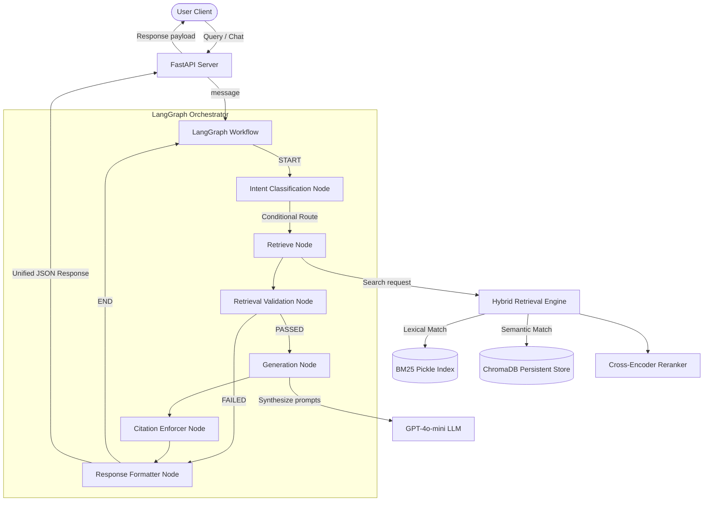
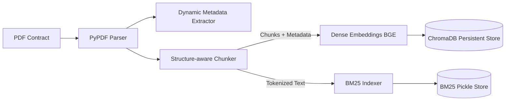
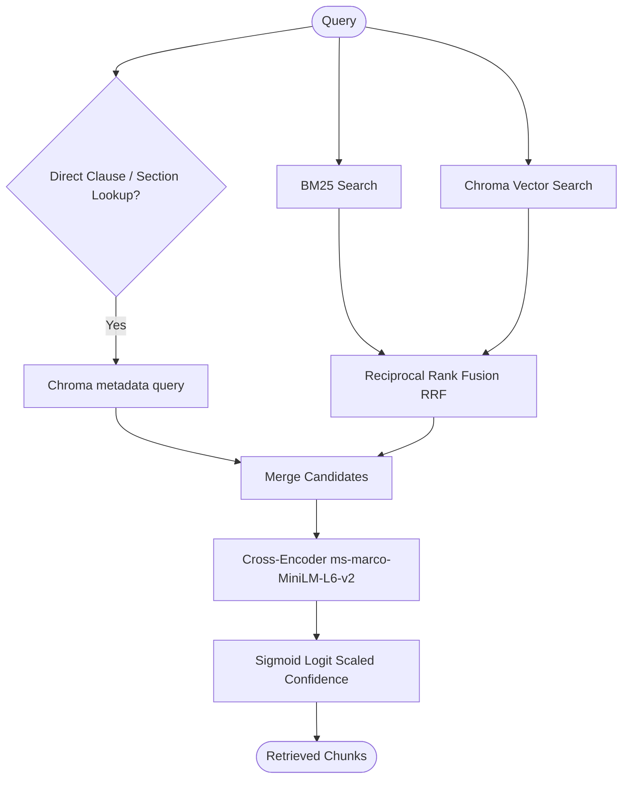
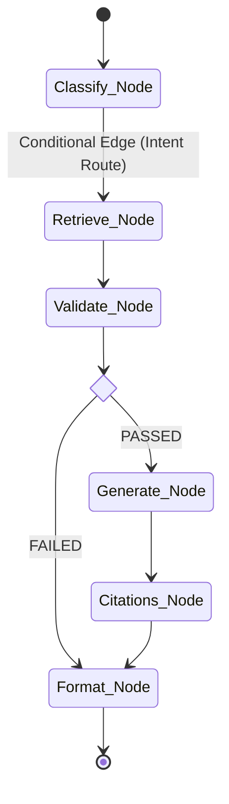

# Architecture Documentation - Legal Contract Intelligence Platform

This document outlines the system architecture, ingestion pipelines, hybrid retrieval schemas, and orchestration workflows.

---

## 1. Overall System Architecture

The overall pipeline manages the flow of incoming queries, parses intents using LLMs, coordinates vector/lexical retrieval, reranks results, generates answers, and enforces formatting constraints.

---

## 2. Document Ingestion Pipeline

Ingestion reads PDF documents, extracts dynamic metadata, segments text using structure-aware rules, and updates indices.

---

## 3. Hybrid Retrieval Pipeline

The retrieval strategy combines dense vector similarity matching and sparse BM25 lookup rank scores using Reciprocal Rank Fusion (RRF), followed by Cross-Encoder rerank scoring.

---

## 4. LangGraph QA Workflow

The orchestration graph uses conditional edges to route states dynamically based on validation passes and intent flags.

